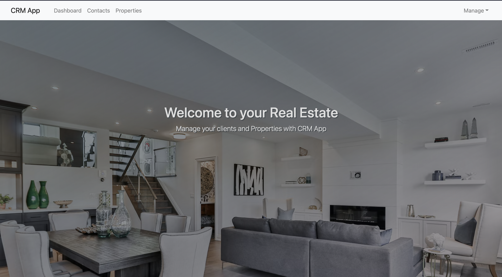

<h1 align="center">CRM App Angular Frontend</h1>

  <h3>
    <a href="https://re-crmapp.web.app/">
      Live Demo
    </a>
     | 
    <a href="https://github.com/Ahiiia92/CRMapp">
      Backend Repo
    </a>
     | 
    <a href="http://localhost:8088/swagger-ui.html#/">
      Documentation
    </a>
  </h3>

## Table of Contents

- [Table of Contents](#table-of-contents)
- [Overview](#overview)
- [How To Use](#how-to-use)
  - [Development server](#development-server)
  - [Code scaffolding](#code-scaffolding)
  - [Build](#build)
  - [Running unit tests](#running-unit-tests)
  - [Running end-to-end tests](#running-end-to-end-tests)
  - [Further help](#further-help)
  - [Built With](#built-with)
- [Features](#features)
- [Acknowledgements](#acknowledgements)
- [Contact](#contact)

<!-- OVERVIEW -->

## Overview

For this project, I started to investigate how to build a full-stack web application with a Spring Boot backend and an Angular Frontend.

- The demo is available at: https://re-crmapp.web.app/
- **What was your experience?**
  I build the backand and the frontend at the same time, while I was learning Angular.
- **What have you learned/improved?**
  If I should reproduce the experience, I would first, focus on the backend. Then on the Frontend. Plus do some refactoring more regularly.
- **Thoughts:**
  I have difficulties with Sprint Boot Security and the front/backend connexion due to a CORS error in the frontend. Need to investigate this further.

## How To Use
### Development server

You would need to fork and clone both repo: backend (current Repo) and frontend (https://github.com/Ahiiia92/CRMapp-angular-frontend).
Then run `mvn spring-boot:run` to run the Spring Boot app and  `ng serve` for a dev server. Navigate to `http://localhost:4200/`. The app will automatically reload if you change any of the source files.

### Code scaffolding

Run `ng generate component component-name` to generate a new component. You can also use `ng generate directive|pipe|service|class|guard|interface|enum|module`.

### Build

Run `ng build` to build the project. The build artifacts will be stored in the `dist/` directory. Use the `--prod` flag for a production build.

### Running unit tests

Run `ng test` to execute the unit tests via [Karma](https://karma-runner.github.io).
=> I didn't go into Frontend Testing yet. Currently are the default tests case generated with the components.

### Running end-to-end tests

Run `ng e2e` to execute the end-to-end tests via [Protractor](http://www.protractortest.org/).

### Further help

To get more help on the Angular CLI use `ng help` or go check out the [Angular CLI Overview and Command Reference](https://angular.io/cli) page.

### Built With

- Java
- Spring Boot
- [PostgreSQL](https://www.postgresql.org/)
- [Angular CLI](https://github.com/angular/angular-cli) version 11.1.1.
- The Frontend is hosted on [Firebase](https://firebase.google.com/)
- The Backend is hosted on [Heroku](https://firebase.google.com/)

## Features

This application frontend was created as a real estate solution to ease pre-sales processes.

It enables real estate agent to manage their contacts.

## Acknowledgements

- [Udemy Course - Angular](https://www.udemy.com/course/the-complete-guide-to-angular-2)
- [Udemy Course - Java Spring Boot](https://www.udemy.com/course/spring-framework-5-beginner-to-guru/)
- FDM Java Training

## Contact

- Website [www.maroussiaarnault.com](https://www.maroussiaarnault.com)
- GitHub [@Ahiiia92](https://github.com/Ahiiia92)
- Twitter [@Marou_arnault](https://twitter.com/Marou_arnault)
